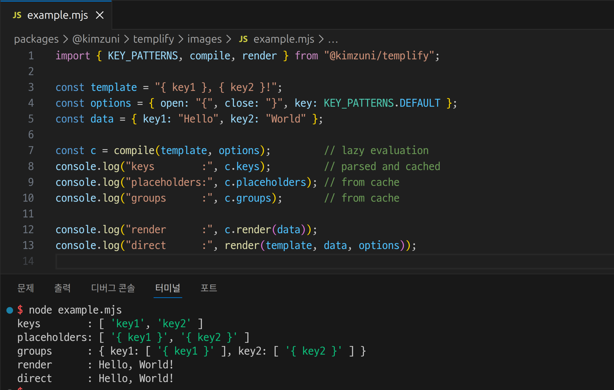

# @kimzuni/templify

[](https://www.npmjs.com/package/@kimzuni/templify)
[](https://codecov.io/gh/kimzuni-labs/templify/tree/main/packages/@kimzuni/templify)

A flexible template string processor for JavaScript and TypeScript.

Supports customizable template delimiters, spacing rules, and fallback values.
Supports both ESM and CommonJS.

The CLI is available as
[@kimzuni/templify-cli](../templify-cli/README.md).


## Overview




## Playground

> [!NOTE]
> The playground provides only the latest release of each supported major version (v3.x or higher).

<https://labs.kimzuni.com/templify/>


## Installation

```shell
# npm
npm install @kimzuni/templify

# yarn
yarn add @kimzuni/templify

# bun
bun add @kimzuni/templify
```


## Example

```javascript
const { compile } = require("@kimzuni/templify");

const template = "{key1} {key1 } { key2} {key1}";
const context = { key1: "value1", key3: "value3" };
const c = compile(template);

console.log(c.keys);
// ["key1", "key2"]

console.log(c.placeholders);
// ["{key1}", "{key1 }", "{ key2}"]

console.log(c.groups);
/*
{
	key1: ["{key1}", "{key1 }"],
	key2: ["{ key2}"],
}
*/

console.log(c.render(context));
// "value1 value1 { key2} value1"

// can use direct render function also
const { render } = require("@kimzuni/templify");
console.log(render(template, context));
// "value1 value1 { key2} value1"
```

### with array

```javascript
const { render } = require("@kimzuni/templify");

const template = "{0} {1} {2} {1}";
const context = ["item1", "item2"];

console.log( render(template, context) );
// "item1 item2 {2} item2"
```

### with deep access

```javascript
const { KEY_PATTERNS, render } = require("@kimzuni/templify");

const template = "{ a } { b.c } { [b.c] } { d['e]f'] } { d['e]f'][0] } { d['e]f'].1 }";
const context = { a: 1, "b.c": 2 d: { "e]f": [3, 4] } };
const options = { key: KEY_PATTERNS.DEEP };

console.log( render(template, options, context) );
// "1 { b.c } 2 { d['e]f'] } 3 4"
```

### without deep access

```javascript
const { KEY_PATTERNS, render } = require("@kimzuni/templify");

const template = "{ a } { b.c } { [b.c] } { d['e]f'] } { d['e]f'][0] } { d['e]f'].1 }";
const context = { a: 1, "b.c": 2 d: { "e]f": [3, 4] } };
const options = { key: KEY_PATTERNS.SHALLOW };

console.log( render(template, options, context) );
// "1 { b.c } { [b.c] } { d['e]f'] } { d['e]f'][0] } { d['e]f'].1 }"
```

### in browser

You can use the browser bundle directly via script tag.

```html
<script src="https://unpkg.com/@kimzuni/templify/dist/browser/index.iife.js"></script>
<script>
	const template = "{ user.name } / { users[0].name }";
	const context = {
		user: { name: "John" },
		users: [{ name: "Doe" }],
	};

	const result = Templify.render(template, context);

	console.log(result); // "John / Doe"
</script>
```


## Options

All options are optional.

### key

> [!TIP]
> `KEY_PATTERNS` provides a set of predefined patterns that can be used for configuration.

Regex pattern defining valid characters for placeholder keys.
Controls which characters are allowed inside the delimiters.
Any regex flags (e.g., `i`, `g`) are ignored if provided.

| Type               | Default value                       |
|--------------------|-------------------------------------|
| `string`, `RegExp` | `/[\w.[\]]+/` (`KEY_PATTERNS.DEEP`) |

```javascript
const { KEY_PATTERNS, render } = require("@kimzuni/templify");

const template = "{ key } { key1 }";
const context = { key: "value", key1: "value1" };
const options = { key: /[a-z]+/ };

const result = render(template, context, options);
console.log(result); // "value { key1 }"
```

### open/close

Custom delimiters for placeholders.
The `open` string marks the start, and `close` marks the end of a placeholder in the template.

| key   | Type     | Default value |
|-------|----------|---------------|
| open  | `string` | `"{"`         |
| close | `string` | `"}"`         |

```javascript
const template = "{{ key1 }} { key1 }";
const context = { key1: "value1" };
const options = { open: "{{", close: "}}" };

const result = render(template, context, options);
console.log(result); // "value1 { key1 }"
```

### spacing

Options for controlling the number of spaces inside template placeholders.
Can be provided as a simple value or as a full object.

| key    | Type                                                 | Default value | Info                                                                                                                  |
|--------|------------------------------------------------------|---------------|-----------------------------------------------------------------------------------------------------------------------|
| strict | `boolean`                                            | `false`       | When `true`, placeholders must have the same number of spaces on both sides of the key to be considered a valid match |
| size   | `number` or `[number]`, `[min: number, max: number]` | `-1`          | Allowed range or number of spaces inside placeholder delimiters. Negative value disables space checking               |

```javascript
const template = "{key1} { key1 } {  key1  } {   key1   } {    key1    } {   key1 }";
const context = { key1: "value1" };

console.log(render(template, context, {
	spacing: -1, // alias for `spacing: { size: -1 }`
}));
// "value1 value1 value1 value1 value1 value1"

console.log(render(template, context, {
	spacing: true, // alias for `spacing: { strict: true }`
}));
// "value1 value1 value1 value1 value1 {   key1 }"

console.log(render(template, context, {
	spacing: {
		size: -1,
	},
}));
// "value1 value1 value1 value1 value1 value1"

console.log(render(template, context, {
	spacing: {
		size: 1,
	},
}));
// "{key1} value1 {  key1  } {   key1   } {    key1    } {   key1 }"

console.log(render(template, context, {
	spacing: {
		size: [1, 3],
	},
}));
// "{key1} value1 value1 value1 {    key1    } value1"

console.log(render(template, context, {
	spacing: {
		strict: true,
		size: [1, 3],
	},
}));
// "{key1} value1 value1 value1 {    key1    } {   key1 }"

console.log(render(template, context, {
	spacing: {
		size: [-1, 1],  // Same as [0, 1]
	},
}));
// "value1 value1 {  key1  } {   key1   } {    key1    } {   key1 }"

console.log(render(template, context, {
	spacing: {
		size: [1, -1],
	},
}));
// "{key1} value1 value1 value1 value1 value1"
```

### fallback

Fallback value to use when a template key is missing.

- `string`, `number`, `boolean`, and `null` are stringified
- `undefined` is treated as absence: the key is considered missing

| Type                                               | Default value |
|----------------------------------------------------|---------------|
| `string`, `number`, `boolean`, `null`, `undefined` | `undefined`   |

```javascript
const template = "{ key } / { key1 } / { key_2 }";
const options = { key: /[a-z0-9]+/ };
const context = { key1: "value1", key_2: "value2" };

console.log(render(template, context, {
	...options,
	fallback: undefined,
}));
// "{ key } / value1 / { key_2 }"

console.log(render(template, context, {
	...options,
	fallback: "x",
}));
// "x / value1 / { key_2 }"

console.log(render(template, context, {
	...options,
	fallback: null,
}));
// "null / value1 / { key_2 }"
```

### depth

> [!NOTE]
> `depth` refers to the nested level of the **context**,
> not the path length of the **key**.

Maximum depth for resolving nested keys.

Keys deeper than the specified depth are ignored.

| Type     | Default value |
|----------|---------------|
| `number` | `1`           |

```javascript
const template = "{ key1 } { key2[0] } { key2[0].key3 }";
const context = { key1: "value1", key2: ["item0", { key3: "value3" }] };
const options = { key: KEY_PATTERNS.DEEP, fallback: "x" };

console.log( render(template, { ...options, depth: -1 }, context) );
// "value1 item0 value3"

console.log( render(template, { ...options, depth: 0 }, context) );
// "x x x

console.log( render(template, { ...options, depth: 2 }, context) );
// "value1 item0 x"
```


## Override Options

Options used to override compile options during rendering.

Support Options:

- [fallback](#fallback)
- [depth](#depth)

```javascript
const template = "{ key } / { key1 } / { key_2 }";
const options = { key: /[a-z0-9]+/, fallback: "fallback" };
const context = { key1: "value1", key_2: "value2" };

const c = compile(template, options);

console.log( c.render(context) );
// "fallback / value1 / { key_2 }"

console.log( c.render(context, { fallback: undefined }) );
// "{ key } / value1 / { key_2 }"

console.log( c.render(context, { fallback: "x" }) );
// "x / value1 / { key_2 }"

console.log( c.render(context, { fallback: null }) );
// "null / value1 / { key_2 }"
```
